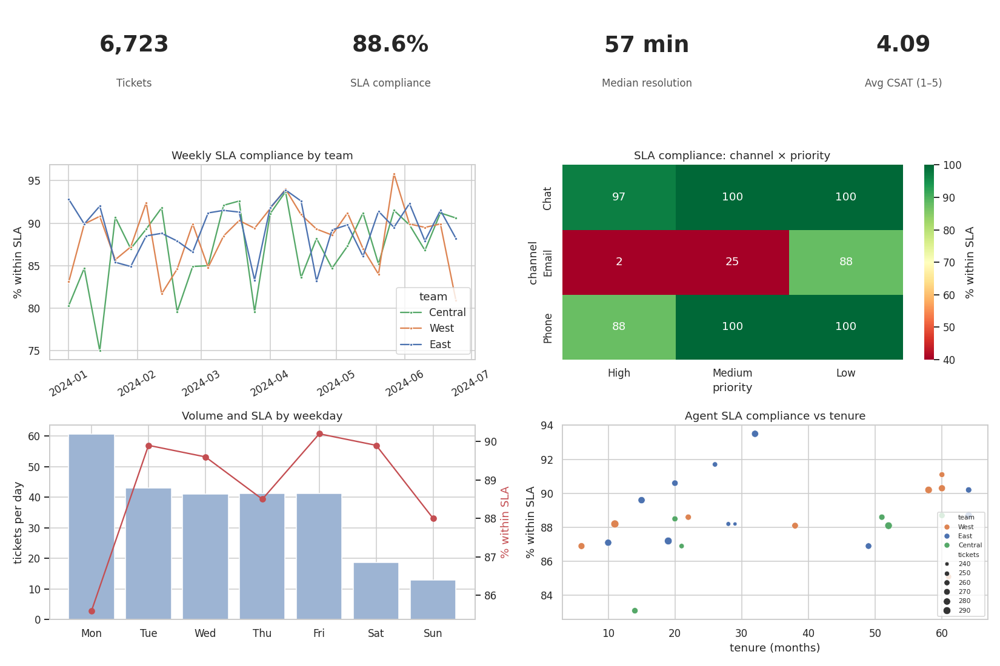

# Member Services Operations Dashboard (Credit Union Support Center)

A weekly operations dashboard for a credit union's member-services team. It answers the questions managers ask:
**are tickets resolved within SLA, where are the bottlenecks, and is slow service hurting member satisfaction?**

Built as a layered pipeline in **PySpark + Spark SQL** that runs unchanged on Databricks or locally. It exports dashboard-ready marts
for **Power BI or Tableau**, and every metric has a written definition in [`docs/metrics.md`](docs/metrics.md).



## What the dashboard shows (6,723 tickets, Jan–Jun 2024)

| KPI | Value |
|---|---|
| SLA compliance | 88.6% |
| Median resolution time | 57 min |
| Average CSAT (1–5) | 4.09, from a 30% survey response rate |

- **Email is the bottleneck.** High-priority email tickets meet their 60-minute SLA only **2%** of the time, and medium-priority email 25%.
  Chat and phone are at 88–100% across priorities. This is the tile a manager would act on first, for example by routing urgent email to chat or phone agents.
- **Breaches cost satisfaction.** Members whose ticket missed SLA rate it **3.17** on average (37% satisfied), vs **4.20** (81% satisfied) when it was resolved in time.
- **Monday is the pressure point.** It averages 61 tickets vs 41–43 on other weekdays, and has the lowest SLA compliance (85.6%).
- **Tenure matters less than channel.** Agents with under a year of tenure are only slightly below veterans on SLA (87.4% vs 89.2%), so the fix is routing, not training.

> **About the data:** it's synthetic. The generator in the notebook builds in realistic patterns (slower email handling, a Monday surge,
> newer agents taking longer, lower CSAT after breaches), and those assumptions are documented in the notebook. The findings above show
> what the dashboard is designed to surface. The work being shown is the data modeling, metric definitions and dashboard design.

## Pipeline

```
raw (synthetic)            silver                          gold (sql/gold_views.sql)         serve
agents, members,   ──►  dashboard_data: one row per  ──►  kpi_summary, weekly_team,   ──►  images/dashboard.png
tickets, surveys        ticket, resolution time,          sla_by_channel_priority,         marts/*.csv → Power BI / Tableau
                        SLA target & flag, tenure,        weekday_load, agent_scorecard,   Delta table + Databricks SQL
                        CSAT                              csat_by_sla                      dashboard (on Databricks)
```

- **Silver** has built-in data checks: the joins can't duplicate tickets, and resolution times can't be negative.
- **SLA targets depend on priority:** High 60 min, Medium 4 h, Low 24 h. The first version used a flat 60 minutes for every ticket.
- **Gold views** are plain Spark SQL, with one view per dashboard tile, so the same logic can be ported to dbt or Databricks SQL.

## Run it

**Databricks:** import `ops_dashboard.ipynb` and run all cells. It writes the Delta table `credit_union.dashboard_data`, and the gold views
can back a Databricks SQL dashboard.

**Locally** (needs Java 11+):

```bash
pip install -r requirements.txt
jupyter nbconvert --to notebook --execute ops_dashboard.ipynb
```

This regenerates the chart in `images/` and the CSV marts in `marts/`. Load the CSVs into Power BI or Tableau to build the same tiles interactively.

## Files

```
ops_dashboard.ipynb        pipeline + dashboard (executed, with outputs)
ops_dashboard.py           same notebook as a script (jupytext)
sql/gold_views.sql         gold-layer views, one per dashboard tile
docs/metrics.md            metric definitions
marts/                     exported gold tables (CSV) for BI tools
images/dashboard.png       rendered dashboard
archive/                   first version (Databricks Community Edition notebook)
```

Tools: PySpark, Spark SQL, Databricks / Delta Lake, pandas, matplotlib/seaborn, Power BI or Tableau (via the CSV marts).

The first version of this project is also published as a
[Databricks notebook](https://databricks-prod-cloudfront.cloud.databricks.com/public/4027ec902e239c93eaaa8714f173bcfc/3452519389878746/2609978118469680/7613518780443247/latest.html).
